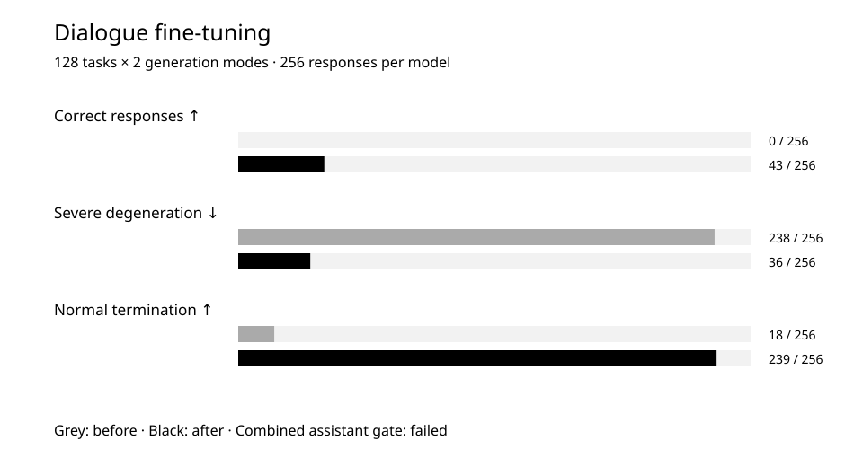

# Dialogue fine-tuning: fewer repetitions, but not enough correct answers

We compared the base model and its fine-tuned version on the same tasks. Answer termination improved and severe degeneration decreased, but assistant acceptance criteria were not met.

Observation dates: 2026-08-23.  
First published on LAB: 2026-09-26.  
GitHub edition prepared: 2026-10-01.

## Research question

Can additional dialogue training improve task correctness as well as the way the model ends its responses?

## Method

The starting point was the model from the completed base-training run. Supervised fine-tuning completed 1,144 optimizer steps with no NaN/Inf failures. Its result was compared with that same base model.

The evaluation contained 128 tasks in two generation modes: greedy decoding and sampling. Each model produced 256 responses. These are 256 results, not 256 independent tasks.

Tasks and semantic criteria were fixed before the fine-tuning data was prepared. The evaluation loader needed a repair to support the fine-tuned model's saved format. Both models were evaluated again after the repair; tasks and scoring rules were unchanged.

We counted task correctness, severe text degeneration, normal termination, token-limit stops and repetition-loop stops separately. These measures are not interchangeable: ending a response correctly does not make its content correct.

## Results

Response form improved substantially. The fine-tuned model was not accepted as a ready assistant.

| Measure | Observation | Interpretation |
| --- | --- | --- |
| Correct task responses | 0 → 43 / 256 | Higher is better |
| Severe degeneration | 238 → 36 / 256 | Lower is better |
| Normal termination | 18 → 239 / 256 | Higher is better |
| Token-limit stops | 210 → 7 / 256 | Lower is better |
| Repetition-loop stops | 28 → 10 / 256 | Lower is better |
| Mean repeated 4-gram ratio | 0.134705 → 0.060744 | A mechanical repetition measure |

[Download chart data (CSV)](../../data/dialogue-observations.csv)

## Discussion

After fine-tuning, normal response termination rose from 18 to 239 cases. Severe degeneration fell from 238 to 36 generations. This is an observed result of changing model weights in the experiment, not of adding interface rules.

Only 43 responses out of 256 were correct. Arithmetic, exact instruction following, grounded answers, multi-turn dialogue and structured JSON still scored zero. Python tasks scored 1 out of 32, clarification 18 out of 32, and honesty about limitations 24 out of 32.

These results do not establish a ready assistant. Reducing repetition and learning dialogue form did not, by themselves, solve task correctness.

## Limitations

- This comparison covers one experiment and one internal task set. It does not describe performance on all user requests or support comparisons with other companies' products.
- Both models received the same tasks. Different generation modes on a single task produce related observations; statistical uncertainty intervals were not calculated for this comparison.
- The data comes from ORCNEIT's log and final report. This experiment has not undergone an independent re-evaluation.

[Original publication](https://orcneitlab.com/en-US/research/dialogue-fine-tuning)

© 2026 ORCNEIT LLC. All rights reserved.
