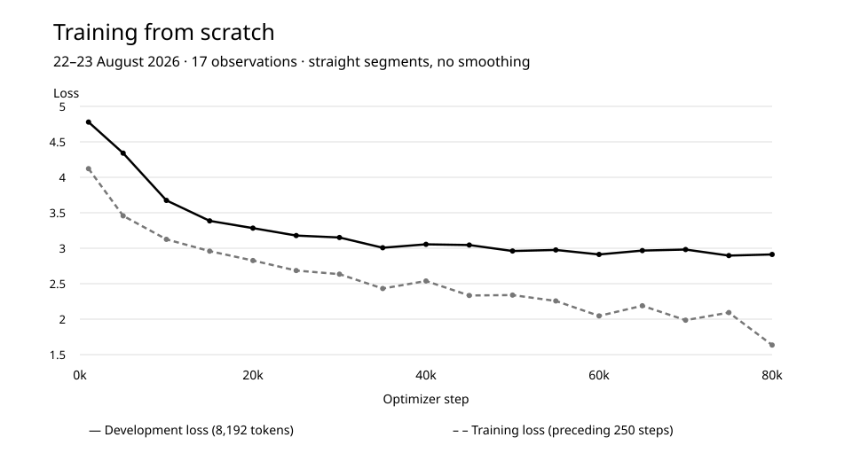

# Training a language model from scratch: measurements and evaluation

A completed run of 80,000 steps and 327.68 million training tokens. We report learning curves and a separate capability evaluation, including the criteria that were not met.

Observation dates: 2026-08-22 — 2026-08-23.  
First published on LAB: 2026-09-26.  
GitHub edition prepared: 2026-10-01.

## Research question

How does prediction loss change when we train our own language model, and does that change translate into success on verifiable tasks?

## Method

The ORCNEIT model was trained from a fresh random initialization, without loading previously trained weights. The run began on 22 August and ended on 23 August 2026. All 80,000 steps completed, with no NaN/Inf numerical failures recorded.

327,680,000 counts training tokens presented to the model, including repeated passes. It is not the number of unique tokens in the source data.

The chart contains 17 telemetry observations: step 1,000, then every 5,000 steps. Training loss is the mean over the preceding 250 steps; development loss is measured on 8,192 tokens. Straight segments connect the observations; no additional smoothing is applied.

After training, a separate evaluation used tasks and scoring rules fixed in advance: 640 primary tasks, 64 context tasks, 640 generations and 256 held-out text windows. All 1,600 results were completed without modifying model weights during evaluation. Regressions were measured against a previously trained internal reference model on the same tasks: cases where the reference answered correctly and the evaluated model did not.

## Results

Training completed, but the model did not pass the combined quality gate.

| Measure | Observation | Interpretation |
| --- | --- | --- |
| Training steps | 80,000 / 80,000 | Completed |
| Training tokens, including repeated exposure | 327,680,000 | Not a count of unique tokens |
| Final development loss | 2.912363 | Separate from the held-out evaluation below |
| Held-out loss | 2.669892 | 262,144 tokens in a separate evaluation |
| Correct answers | 161 / 640 | Below the required 167 / 640 |
| Context tasks | 24 / 64 | Above the required 17 / 64 |
| Severely degenerate generations | 203 / 640 | Within the maximum of 271 |
| Paired task regressions | 178 | Above the maximum of 7 |

[Download chart data (CSV)](../../data/training-observations.csv)

## Discussion

Development loss fell from 4.778937 to 2.912363 between the reported checkpoints. This measures improved text prediction, not general understanding or dialogue readiness.

The separate primary evaluation recorded 161 correct answers out of 640. Its lower 95% bootstrap bound of 0.21875 did not exceed the 0.25 reference level. This criterion therefore does not establish performance above chance.

Some aggregate measurements improved, but paired evaluation revealed too many new errors. The gate remained failed: better loss and context performance cannot cancel those regressions.

## Limitations

- This is one internal experiment, not a comparison with commercial models or an independent assessment. Repeated runs to estimate variability are not reported here.
- Development loss in the chart and held-out loss in the table use different evaluation samples. The two values must not be compared directly.
- This report covers a completed August 2026 experiment, not current model availability. The published values alone do not allow independent reproduction of the complete run.

[Original publication](https://orcneitlab.com/en-US/research/language-model-pretraining)

© 2026 ORCNEIT LLC. All rights reserved.
