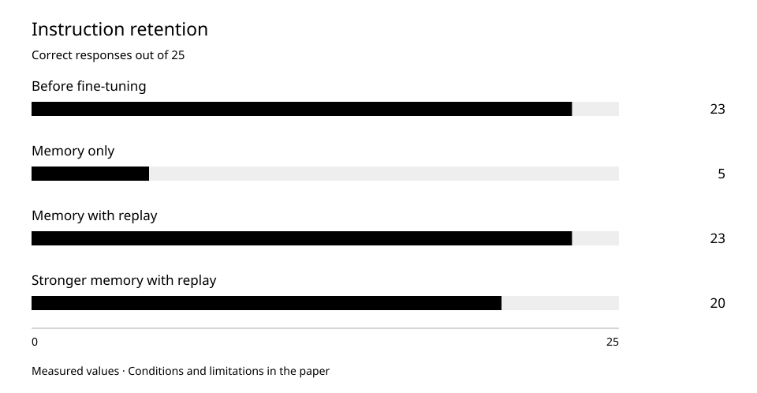

# Learning memory: retaining old skills does not establish new ones

Three small-model experiments exposed forgetting, the benefit of replay, and the absence of a reliable memory protocol despite lower training loss.

Observation period: 2026-06-25 — 2026-06-25.  
Published: 2026-10-01.

## Research question

Can a small language model learn memory operations while preserving ordinary instruction following?

## Methods

We studied our own roughly 4-million-parameter model with 400 records: 320 training, 40 development and 40 held-out. Each of three attempts began from the same base model. This was a diagnostic sequence, not a randomized single-factor study.

The first attempt trained memory operations. The second added replay of prior training material and aligned training-response formatting with evaluation. The third strengthened memory training while retaining replay. Several conditions changed between attempts, so gains cannot be attributed to one setting alone.

General skills were evaluated with separate unchanged tests. The chart shows correct responses on 25 instructions, not memory tasks or knowledge on arbitrary requests.

An early measurement defect retained only the first response line although several protocols required multiple lines. Early zero scores on multiline operations therefore are not clean evidence of missing skills. Extraction was repaired and multiline preservation tested before the final attempt. Final results are reported separately.

Final memory evaluation contained 54 intent, 40 record-normalization, 48 safety, 56 change-proposal/confirmation and 48 abstention cases: 246 total. The 56 change cases contained 72 evaluated turns; turns are not added to case counts. Success required valid protocol output and task-specific correctness.

## Results

Replay helped retain prior skills, but the final model passed none of 246 memory cases.

The same general instruction test, not a memory score. Four model states; the axis starts at zero.

| Measure | Observation | Interpretation |
| --- | --- | --- |
| General instructions: base model | 23 / 25 | 92% |
| General instructions: memory only | 5 / 25 | 20%; substantial forgetting |
| General instructions: memory with replay | 23 / 25 | 92%; other conditions also changed |
| General instructions: stronger training | 20 / 25 | 80%; some regression remained |
| Final development memory loss | 5.7350 → 2.5970 | Five epochs; not task success |
| Separate held-out memory loss | 2.6042 | Distinct from general instruction evaluation |
| Successful memory cases | 0 / 246 | Five categories; repaired response extraction |
| Intent recognition | 1 / 54 protocol-parsed; 0 successful | Parseable format does not establish correctness |

## Numerical appendices

- [memory-instruction.csv](../../data/memory-instruction.csv)
- [memory-protocol.csv](../../data/memory-protocol.csv)
- [memory-learning.csv](../../data/memory-learning.csv)

## Discussion

Training only the new task reduced general instruction success from 92% to 20%. The second attempt, including replay, restored this score to 92%. This is an observed difference on a fixed small test, not a universal retention guarantee.

Final development memory loss decreased through 5.7350, 4.0609, 3.3282, 2.8774 and 2.5970. Yet the model still failed to emit the required protocol. Even the single parsed intent output did not pass its task. Lower loss and successful memory operations are different outcomes.

The failure does not establish that all small models cannot learn memory. One architecture, limited data and three regimes were tested. Stopping this direction under the existing conditions was a decision about these experiments.

## Limitations

- Early multiline scores are limited by extraction defects and are not pooled with the corrected final evaluation into a memory curve. Repairing a measurement instrument is not model improvement.
- General tests are small, repeated runs for variability are absent, and several factors changed across attempts. The comparison does not isolate the independent causal effect of replay alone.
- This evaluates model-generated memory protocols, not an external store, deployed-system security or finished-product quality. Independent experimental replication is not provided.

[ORCNEIT Lab Research](https://orcneitlab.com/en-US/research)

© 2026 ORCNEIT LLC. All rights reserved.
