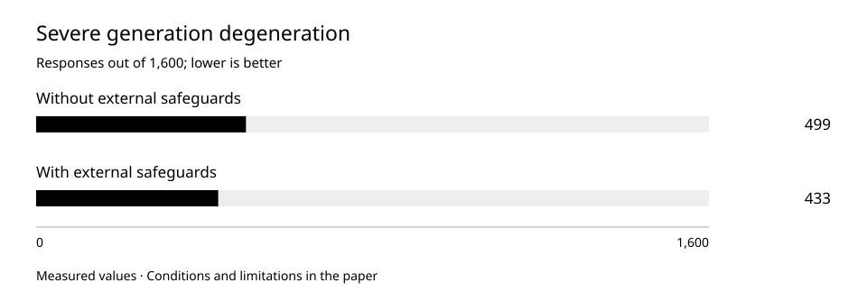

# Response safeguards and model capability: what actually changes

Rules around a model can improve observed output without changing its weights. We examine an early assistant-versus-model comparison and a separate test of encoding and repetition safeguards.

Observation period: 2026-06-14 — 2026-08-20.  
Published: 2026-10-01.

## Research question

Which improvements come from output control, and which cannot be attributed to learned model capability?

## Methods

We examine two different experiments. June compared an early model with a rule-controlled system on 79 tasks. August tested a different model with output safeguards on 400 prompts in four modes. These experiments cannot form one quality curve.

The early system classified requests, constrained inappropriate formats and used prepared template responses instead of model calls in several categories. June therefore measures the entire system, not only the neural model. Passes, near-passes and failures were counted separately.

On 20 August unchanged weights were compared under ordinary generation and two external constraints: UTF-8 validity during continuation selection and stopping detected repetition loops. No fine-tuning occurred. Identical prompts were used with one greedy mode and three fixed sampling seeds: 1,600 responses per alternative.

Severe degeneration was predefined as an empty response, at least ten identical consecutive tokens, repeated-4-gram ratio at least 0.5, or a line repeated at least three times. Reasons may overlap. These detect generation breakdown, not truth or usefulness.

Paired cases were classified by whether degeneration disappeared, emerged, persisted or was absent in both outputs. Encoding and repetition were separated from termination type. Controller stops are not credited as natural termination learned by the model.

## Results

Safeguards reduced severe degeneration and eliminated observed UTF-8 failures. They did not change model weights or establish semantic-capability gains.

August paired comparison on unchanged model weights: 400 prompts × 4 modes. Mechanical generation defects, not semantic correctness.

| Measure | Observation | Interpretation |
| --- | --- | --- |
| Early tasks: raw model | 29 passes; 10 near; 40 failures out of 79 | 36.7% passes |
| Early tasks: rule-controlled system | 72 passes; 7 near; 0 failures out of 79 | 91.1%; some responses bypassed the model |
| August: severe degeneration | 499 → 433 / 1,600 | 31.1875% → 27.0625% |
| August: paired transitions | 141 improved; 75 regressed | 1,026 non-severe and 358 severe in both |
| August: greedy mode | 363 → 317 / 400 | 46 improved; 0 regressed |
| August: three sampling modes pooled | 136 → 116 / 1,200 | 95 improved; 75 regressed |
| August: strict UTF-8 validation | 14 → 0 invalid responses | Output constraints, not repaired weights |

## Numerical appendices

- [response-control.csv](../../data/response-control.csv)
- [early-system-evaluation.csv](../../data/early-system-evaluation.csv)

## Discussion

June's 91.1% is not raw-model accuracy: external rules could replace generation entirely. Separate scores reveal the interface contribution and the model without that assistance.

August produced 66 fewer severe cases: 4.125 percentage points, or about 13.23% of the original count. Yet 75 responses became severe. Reporting only the total would hide regressions.

Effects differ by decoding mode. Greedy output improved 46 cases with no new severe cases; sampling improved 95 and regressed 75. Modes are reported separately without promising equal gains for every request.

The controller stopped 251 periodic loops and 140 n-gram repetitions. Natural termination occurred in 40 cases and the length limit in 1,169; these four termination types total 1,600. Stopping bad output is a useful safeguard, not proof that the model learned to end a thought.

## Limitations

- August's 1,600 results come from 400 prompts; modes for the same prompt are related. They are not 1,600 independent user tasks. Prompt-clustered confidence intervals or significance are not claimed here.
- Semantic coherence and answer correctness were not measured by this comparison. Zero UTF-8 failures does not mean zero factual errors or complete system safety.
- The comparisons use different models, controls and samples. Safeguards are not accepted as repaired weights or ready-assistant evidence. Independent reevaluation is not provided.

[ORCNEIT Lab Research](https://orcneitlab.com/en-US/research)

© 2026 ORCNEIT LLC. All rights reserved.
