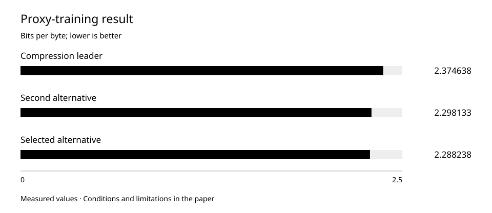

# Choosing tokenization through training, not compression alone

The compression leader did not lead proxy training. Equal-source-text comparison changed the selection and showed why tokenized length alone is insufficient.

Observation period: 2026-07-05 — 2026-07-05.  
Published: 2026-10-01.

## Research question

Does selection by text compression agree with selection by model training on that text?

## Methods

On 5 July we compared three self-written tokenization alternatives. A tokenizer turns text into model-input units. Preliminary compactness-based selection favoured one alternative; final selection used separate short training runs.

All alternatives received the same ordered text: 6,169 documents and 41,942,946 UTF-8 bytes. The shared held-out set contained 10,051,479 bytes. Runs used a fixed roughly 292-million-parameter proxy architecture and one common seed. Source documents and their order did not change between alternatives.

The budget was matched by source text, not tokens. Equal tokens would let a stronger compressor see more original material. Here token and step counts differed as expected: 11,973,646 and 365; 16,653,321 and 508; 17,236,892 and 526. This matches text exposure, not update count or compute.

The primary measure was bits per source-text byte: normalized prediction error with fixed text-group weights. Lower is better. It allows comparison across segmentations; ordinary per-token loss is not directly comparable for that purpose.

The predefined practical-equivalence threshold was 0.003 bits per byte. A further seed was required only if the two best final scores differed by no more than that threshold. Their 0.0098948263 difference exceeded it, so no additional decision run was used. An intermediate ranking change was not turned into a new post-hoc criterion.

## Results

The preliminary compression leader lost on the selected proxy-training metric. Compression and learnability are not interchangeable.

Three alternatives on identical source text. Byte-normalized measure, zero-based axis. Proxy-model text prediction, not finished-assistant quality.

| Measure | Observation | Interpretation |
| --- | --- | --- |
| Compression leader: final score | 2.374638 bits/byte | 11,973,646 tokens; 365 steps |
| Second alternative: final score | 2.298133 bits/byte | 16,653,321 tokens; 508 steps |
| Selected alternative: final score | 2.288238 bits/byte | 17,236,892 tokens; 526 steps |
| Gap between the two best | 0.0098948263 bits/byte | Above the 0.003 threshold |
| Shared training text | 41,942,946 bytes; 6,169 documents | Identical content and order |
| Shared held-out text | 10,051,479 bytes | Not proxy-model training material |

## Numerical appendices

- [tokenization-proxy.csv](../../data/tokenization-proxy.csv)

## Discussion

The most compact representation described the same text in fewer tokens. Yet its proxy-training result was worse than both alternatives. The selected representation compressed less but achieved lower normalized prediction error.

The best-to-second gap is small: about 0.43% relative to the second. The 0.003 threshold is a decision rule, not a confidence interval or statistical-significance result. The conclusion is limited to one seed and the stated budget.

This comparison addresses selection under a fixed source-text budget. It does not isolate tokenization at equal compute because update counts differ. Answering that different question requires a separately predefined experiment.

## Limitations

- A proxy model and limited text do not establish better semantic correctness, conversation or final large-model quality.
- No completed repeated-seed comparisons enter this decision. A practical threshold does not replace variability estimates; universal superiority is not claimed.
- This July segmentation comparison is not the August vocabulary-size comparison in another paper. Samples, goals and metrics differ and are not pooled.

[ORCNEIT Lab Research](https://orcneitlab.com/en-US/research)

© 2026 ORCNEIT LLC. All rights reserved.
