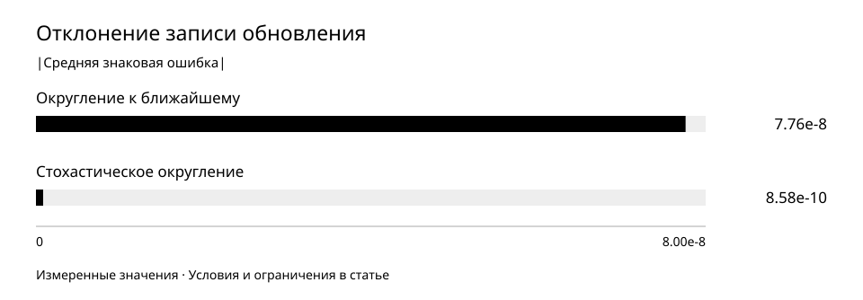

# Как сохранить малые обновления при обучении

Короткая контролируемая проверка численной точности показала уменьшение среднего знакового отклонения записи обновлений примерно в 90 раз. Отдельный более поздний запуск подтвердил устойчивость обучения с точным состоянием, но не готовность модели.

Период наблюдений: 2026-07-07 — 2026-08-21.  
Опубликовано: 2026-10-01.

## Исследовательский вопрос

Что происходит с малыми обновлениями весов при округлении и можно ли уменьшить систематическое отклонение, не подменяя это выводом о качестве модели?

## Методика

7 июля сравнили три вычислительных варианта от одинакового исходного состояния: прежние вычисления с округлением к ближайшему; вычисления обновления в повышенной точности с тем же округлением; тот же второй вариант со стохастическим округлением только при записи веса. Каждая ветвь ограничена 20 шагами. Порядок данных, исходные веса и остальные условия сравнения сохранены.

BF16 — числовой формат с ограниченным шагом представления веса. Если обновление меньше половины такого шага, обычное округление может записать прежнее значение. Стохастическое округление выбирает соседнее представимое число вероятностно, чтобы не отбрасывать одно направление малых обновлений систематически. Проверяли конкретную реализацию и её ошибки, а не новое научное изобретение самого метода.

Основное измерение — модуль среднего знакового отклонения фактически записанного обновления от рассчитанного в повышенной точности, на первом одинаковом шаге реальных тензоров. Это показатель смещения: большие ошибки разных знаков могут компенсироваться. Он не равен средней абсолютной ошибке отдельных весов.

Дополнительно использовали синтетические проверки малых обновлений и сохранения последовательности случайного округления. Раздельно проверяли непрерывное выполнение и выполнение после прерывания. Полное обучение не было побитно воспроизводимым; различие после возобновления находилось около измеренного разброса повторных непрерывных запусков.

21 августа отдельно завершился запуск на 1 200 шагов и 4 915 200 предъявленных токенов с сохранением основных весов и состояний оптимизатора в FP32 и вычислениями модели в BF16. Это другая модель и другие условия, не продолжение июльского сравнения. Его используют только как отдельное свидетельство работоспособности точного состояния обучения, а не причинное сравнение двух методов.

## Результаты

В короткой проверке стохастическое округление уменьшило измеренное смещение примерно в 90 раз. Улучшение ответов этим экспериментом не доказано.

Меньше — лучше. Измерение первого шага на одинаковых реальных весах и градиентах. Это среднее знаковое отклонение, не средняя абсолютная ошибка каждого веса и не качество ответов.

| Показатель | Наблюдение | Интерпретация |
| --- | --- | --- |
| Вычисления обновления с обычным округлением | 7,76 × 10⁻⁸ | Модуль среднего знакового отклонения |
| Та же арифметика со стохастическим округлением | 8,58 × 10⁻¹⁰ | Изменён только способ записи веса |
| Отношение двух отклонений | ≈ 90,44 | Не увеличение качества модели в 90 раз |
| Рассчитанные обновления меньше половины шага BF16 | Около 95% в исследованных блоках; 99,7% в представлении токенов | Первый шаг; не все веса на всех шагах |
| Максимальное синтетическое смещение | 1,2 × 10⁻³ шага представления | Отдельная проверка округления |
| Поздний отдельный запуск с FP32-состоянием | 1 200 шагов; NaN/Inf — 0 | Технически завершён, поведенческая проверка не пройдена |
| Тяжёлые нарушения в поздней проверке | 487 / 1 600 | Выше установленного предела 10% |

## Числовые приложения

- [update-rounding.csv](../../data/update-rounding.csv)
- [numerical-stability.csv](../../data/numerical-stability.csv)

## Обсуждение

Повышение точности промежуточной арифметики без изменения записи веса оставило измеренное смещение около прежнего уровня. Разница проявилась при замене только округления. Это локализует численный эффект внутри короткого контролируемого сравнения.

Стохастическое округление не обязано менять каждый вес на каждом шаге: многие записи остаются нулевыми, а небольшие движения реализуются вероятностно. Поэтому уменьшение среднего смещения не означает исчезновение всех индивидуальных ошибок.

Причинная связь между этой проблемой и ухудшением длинных генераций не установлена. У данных, режима обучения и способа генерации остаются другие возможные эффекты. Июльская проверка вообще не оценивала качество ответов.

Отдельный августовский запуск с FP32-состоянием завершил все обновления без нечисловых значений. Однако на 1 600 генерациях получены 487 тяжёлых нарушений, и проверка качества не пройдена. Это наглядно разделяет численную устойчивость и освоенные способности.

## Ограничения

- Число шагов июльского сравнения невелико. Около 90-кратного отношения относится к указанному агрегату первого шага, не к длительному обучению, скорости, каждой ошибке веса или качеству текста.
- Последовательность случайного округления после сохранения воспроизводилась в синтетической проверке; полная модель имела вычислительный разброс. Нельзя заявлять побитно одинаковое возобновление всего обучения.
- Июльское сравнение и августовский запуск имеют разные цели, модели и данные. Их показатели не складываются в общую кривую и не доказывают превосходство одного полного режима обучения над другим. Независимое повторение здесь не представлено.

[Исследования ORCNEIT Lab](https://orcneitlab.com/ru-RU/research)

© 2026 ORCNEIT LLC. All rights reserved.
