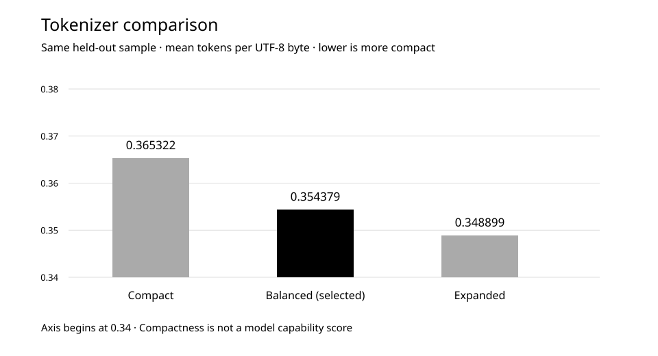

# Почему мы пересобираем обучающий корпус

Неудачные проверки модели заставили пересмотреть не только обучение, но и данные, токенизацию и саму оценку. Разбираем измеренные результаты этих изменений и работу над новым корпусом, которая продолжается на 26 сентября 2026 года.

Даты наблюдений: 2026-08-20 — 2026-09-26.  
Впервые опубликовано на LAB: 2026-09-26.  
Редакция для GitHub подготовлена: 2026-10-01.

Статус: в работе **по состоянию на 26 сентября 2026 года**.

## Исследовательский вопрос

Что нужно изменить, когда дополнительное обучение почти не улучшает ответы: продолжать прежнюю модель или заново проверить основу, на которой она обучается?

## Методика

20 августа мы отказались от дальнейшего продолжения одной из ранних моделей. Дополнительные 353,8 млн предъявлений токенов не дали общего улучшения свободной генерации: на одинаковых проверках число ответов с тяжёлыми повторами изменилось с 497 до 499 из 1 600. Контрольное продолжение и два отдельных изменения режима обучения также не дали принятого исправления. Это решение относилось к конкретной модели; проверенные инструменты и результаты экспериментов сохранили.

Следующую модель готовили с новой инициализацией и заново проверенной обработкой текста. Токенизатор — механизм разбиения текста на единицы, с которыми работает модель, — проверяли на точное восстановление исходных данных, корректность Unicode, сохранение переносов строк и кода. Затем сравнили три размера словаря на одной и той же отложенной выборке. Названия в графике обозначают варианты этого сравнения, а не последовательные версии продукта.

Метрика сравнения — среднее число токенов на байт UTF-8 с равным весом четырёх групп: русского и английского текста, технических материалов и кода. При одинаковом тексте меньшее значение означает более компактную запись. Все три варианта прошли проверки целостности; среди вариантов, отстающих от лучшего не более чем на 3%, выбрали меньший словарь.

Проверку модели тоже переработали. К диагностике повторов добавили задания с проверяемыми ответами, работу с контекстом и проверку структуры кода. В вопросах с выбором ответа обнаружили перекос: варианты имели разную длину при подсчёте вероятности. Полные варианты оставили в условии, а оценивать стали однотокенные метки. Все 2 816 оцениваемых продолжений получили одинаковую длину.

Ускорение оценщика принимали только при совпадении с эталонным вычислением. На фиксированном проверочном запуске сравнивали идентификаторы токенов, декодированный текст и состояние завершения ответа. Отдельно проверили восстановление после принудительного прерывания: итоговые файлы совпали побайтно с непрерывным запуском.

23 августа завершились базовое обучение и диалоговое дообучение, описанные в двух соседних работах. Оба не прошли свои критерии качества. После этого решили готовить существенно больший и более разнообразный корпус, а не бесконечно дообучать те же веса. Цель — 4 млрд обучающих токенов плюс отдельные проверочные выборки. Это плановый объём, не счётчик уже готовых данных.

## Результаты

Токенизация и проверка модели получили измеримые улучшения. Новый большой корпус ещё не принят; его подготовка продолжается.

| Показатель | Наблюдение | Интерпретация |
| --- | --- | --- |
| Сравнение словарей на одной выборке | 0,365322 → 0,354379 → 0,348899 | Токенов на байт; выбран средний вариант |
| Стоимость выбранного словаря | На 25% меньше параметров словарной матрицы | По сравнению с самым большим вариантом при одинаковой ширине; не всей модели |
| Полная проверка токенизации подготовленного тогда набора | 262 265 / 262 265 записей | 0 ошибок восстановления и 0 добавленных символов замены |
| Разница длины оцениваемых вариантов ответа | До 17 токенов → 0 | Устранён перекос подсчёта, а не ошибки модели |
| Проверочный запуск оценщика | 16,9655 → 4,6099 с | 512 сгенерированных токенов; результат совпал |
| Подготовка нового корпуса на 26.09.2026 | В работе | Идёт проверка точных и близких дубликатов; окончательной приёмки нет |

[Данные графика (CSV)](../../data/tokenizer-comparison.csv)

## Обсуждение

Самый большой словарь дал наиболее компактную запись текста, но выбранный средний вариант отстал от него примерно на 1,57% и потребовал на четверть меньше параметров словарной матрицы. Это измеренный компромисс между компактностью и стоимостью, а не утверждение, что модель стала на столько же умнее.

Проверка на всём подготовленном наборе нашла то, чего не показала малая выборка: три редких символа в контрольных данных требовали перехода к побайтовому представлению. Оно оставалось обратимым, но не соответствовало установленному требованию покрытия. Алфавит дополнили этими символами, не используя контрольные тексты и их частоты для обучения правил объединения. Повторная полная токенизация прошла проверку всех 262 265 записей.

Новый оценщик стал задавать более содержательные вопросы к модели. Он проверяет не только отсутствие повторов, но и правильность решения. До проверки модели задания сопоставили с фактически используемыми обучающими потоками: заданные процедуры не нашли точных совпадений или близких копий. Это результат конкретной проверки, а не гарантия отсутствия любых возможных утечек.

В инженерном тесте оценщик ускорился примерно в 3,68 раза без изменения результата. Более быстрые варианты отвергли: один менял 15 из 16 проверенных продолжений, другой — 6 из 8. Быстрее считать другой результат для сравнения моделей неприемлемо.

Сейчас основная работа — подготовка данных. Получение источника ещё не делает его частью обучающего корпуса: нужны проверка содержания, происхождения, дубликатов и пересечений между обучающей и контрольной частями. На 26 сентября выполняется обработка точных и близких дубликатов. Финальная проверка пересечений и приёмка корпуса ещё впереди; обучение модели на новом большом корпусе не началось.

## Ограничения

- Сравнение словарей проведено в августе на одной фиксированной выборке. Оно не доказывает такие же соотношения на будущем корпусе. Перед его использованием токенизатор потребуется проверить на новых данных.
- Тест ускорения оценщика использовал модель со случайной инициализацией, 512 токенов и один вычислительный стенд. Это измерение механики проверки, не бенчмарк качества обученной модели и не обещание постоянного ускорения.
- Проверки ранней модели и последующих экспериментов используют разные протоколы. Их счётчики нельзя напрямую объединять в единую кривую качества. Улучшения инструментов сами по себе не означают успешной приёмки модели.
- 4 млрд токенов — целевой объём. Здесь нет заявления, что этот объём уже собран, очищен или использован в обучении. Состояние работ зафиксировано на 26 сентября 2026 года; дата завершения пока не определена.

[Публикация на сайте лаборатории](https://orcneitlab.com/ru-RU/research/rebuilding-the-training-foundation)

© 2026 ORCNEIT LLC. Все права защищены.
