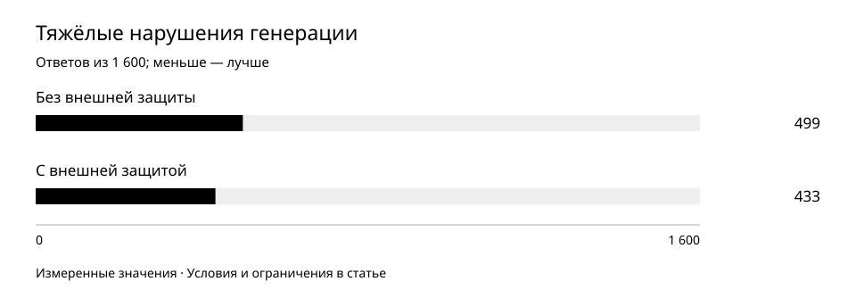

# Внешняя защита ответов и способности модели: что меняется на самом деле

Правила вокруг модели могут улучшать наблюдаемый результат без изменения её весов. Разбираем раннее сравнение ассистента и модели и отдельную проверку защиты от некорректного текста и повторов.

Период наблюдений: 2026-06-14 — 2026-08-20.  
Опубликовано: 2026-10-01.

## Исследовательский вопрос

Какие улучшения создаёт управление выводом и какие из них нельзя приписывать обученным способностям модели?

## Методика

Рассматриваем два разных эксперимента. В июне сравнили раннюю модель и систему с внешними правилами на 79 заданиях. В августе проверили другую модель с защитой вывода на 400 запросах в четырёх режимах. Между этими экспериментами нельзя строить общую кривую качества.

Ранняя система определяла тип запроса, ограничивала неподходящие форматы и в нескольких категориях отвечала заранее подготовленными шаблонами вместо вызова модели. Поэтому июньское сравнение измеряет систему целиком, не только нейросеть. Пройденные задания, близкие ответы и неудачи считались раздельно.

20 августа сравнили неизменные веса с обычным выводом и с двумя внешними ограничениями: допустимость UTF-8 при выборе продолжения и остановка обнаруженных повторяющихся петель. Модель не дообучали. Использовали одинаковые запросы, один детерминированный режим и три фиксированных seed выборки: по 1 600 ответов в каждом варианте.

Тяжёлое нарушение определялось заранее по пустому ответу, не менее десяти одинаковым токенам подряд, доле повторных 4-грамм не менее 0,5 либо строке, повторённой не менее трёх раз. Причины могут пересекаться. Эти признаки измеряют распад генерации, не истинность или полезность содержания.

Для парного сравнения отдельно считали случаи, где нарушение исчезло, появилось, сохранилось или отсутствовало в обоих вариантах. Повторы и корректность кодировки оценивали отдельно от способа остановки. Остановка контроллером не засчитывается как естественное завершение, освоенное моделью.

## Результаты

Защита вывода уменьшила число тяжёлых нарушений и убрала измеренные ошибки UTF-8. Веса и доказанные смысловые способности модели от этого не изменились.

Августовское парное сравнение на одной модели с неизменными весами: 400 запросов × 4 режима. Это механические нарушения генерации, не смысловая правильность.

| Показатель | Наблюдение | Интерпретация |
| --- | --- | --- |
| Ранние задания: исходная модель | 29 успешных; 10 близких; 40 неудач из 79 | 36,7% успешных |
| Ранние задания: система с правилами | 72 успешных; 7 близких; 0 неудач из 79 | 91,1%; часть ответов — шаблоны без вызова модели |
| Август: тяжёлые нарушения | 499 → 433 / 1 600 | 31,1875% → 27,0625% |
| Август: парные переходы | 141 улучшение; 75 ухудшений | 1 026 без нарушения; 358 с нарушением в обоих |
| Август: детерминированный режим | 363 → 317 / 400 | 46 улучшений; 0 ухудшений |
| Август: три режима выборки вместе | 136 → 116 / 1 200 | 95 улучшений; 75 ухудшений |
| Август: строгая проверка UTF-8 | 14 → 0 некорректных ответов | Контроль допустимости вывода, не исправление весов |

## Числовые приложения

- [response-control.csv](../../data/response-control.csv)
- [early-system-evaluation.csv](../../data/early-system-evaluation.csv)

## Обсуждение

Июньские 91,1% нельзя объявлять точностью самой модели: внешние правила могли полностью заменить генерацию. Разделение результатов показывает, какой эффект относится к интерфейсу и как выглядит модель без этой помощи.

В августовском сравнении суммарно стало на 66 тяжёлых нарушений меньше — на 4,125 процентного пункта, или примерно на 13,23% относительно исходного числа. Однако 75 ответов перешли в плохую категорию. Только общий счётчик скрывал бы эти регрессии.

Эффект неодинаков по режимам. Детерминированный вывод дал 46 улучшений без новых тяжёлых нарушений; в выборке улучшений было 95, ухудшений 75. Результаты режимов показаны раздельно, без обещания одинакового выигрыша на каждом запросе.

Контроллер остановил 251 периодическую петлю и 140 повторов n-грамм. Естественное завершение произошло в 40 случаях, лимит длины — в 1 169. Эти четыре вида остановки дают ровно 1 600. Прекращение плохого вывода — полезный защитный эффект, но не доказательство, что модель научилась вовремя заканчивать мысль.

## Ограничения

- В августе 1 600 результатов получены из 400 запросов; режимы одного запроса связаны. Они не представляют 1 600 независимых пользовательских задач. Статистическая значимость и доверительные интервалы с группировкой по запросам здесь не заявляются.
- Смысловая связность и правильность ответов этим сравнением не измерялись. Ноль ошибок UTF-8 не означает ноль фактических ошибок или полную безопасность системы.
- Два сравнения относятся к разным моделям, методам управления и выборкам. Защита не принята как исправление весов или доказательство готовности ассистента; независимая переоценка не представлена.

[Исследования ORCNEIT Lab](https://orcneitlab.com/ru-RU/research)

© 2026 ORCNEIT LLC. All rights reserved.
