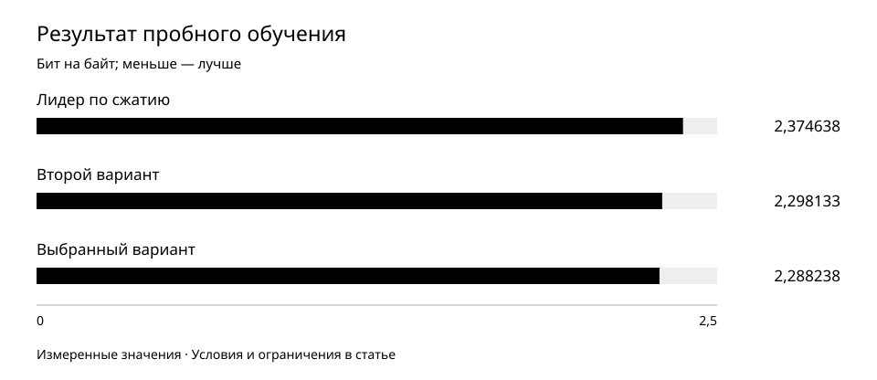

# Выбор токенизации через обучение, а не только через сжатие

Лидер по компактности текста не стал лидером пробного обучения. Сравнение на одинаковых исходных документах изменило выбор и показало, почему длины токенизированного текста недостаточно.

Период наблюдений: 2026-07-05 — 2026-07-05.  
Опубликовано: 2026-10-01.

## Исследовательский вопрос

Совпадает ли выбор по степени сжатия текста с выбором по результатам обучения модели на этом тексте?

## Методика

5 июля сравнили три собственных варианта токенизации. Токенизатор превращает текст в последовательность единиц для модели. Предварительный выбор по компактности отдавал предпочтение одному варианту; окончательный выбор проверяли через отдельное короткое обучение.

Все варианты получили один и тот же упорядоченный текст: 6 169 документов, 41 942 946 байт UTF-8. Отложенная выборка — 10 051 479 байт, одинаковая для всех. Сравнивали фиксированную архитектуру пробной модели примерно на 292 млн параметров и один общий seed. Исходные документы и их порядок не менялись между вариантами.

Бюджет уравняли по исходному тексту, не по числу токенов. При одинаковом числе токенов более сильный компрессор увидел бы больше исходного материала. Здесь токенов и шагов закономерно получилось разное количество: 11 973 646 и 365; 16 653 321 и 508; 17 236 892 и 526. Это равный текстовый бюджет, не равное число обновлений или вычислений.

Основная метрика — бит на байт исходного текста, нормированная ошибка предсказания с зафиксированным взвешиванием текстовых групп. Меньше — лучше. Она позволяет сравнивать разные разбиения текста; обычный loss на токен напрямую для этого не подходит.

Заранее установленный порог практической близости — 0,003 бит на байт. Дополнительный seed требовался при разнице двух лучших итогов не выше этого порога. Фактическая разница 0,0098948263 превысила порог, поэтому дополнительный запуск для решения не использовали. Промежуточную смену порядка вариантов не превращали в новый критерий после наблюдения результатов.

## Результаты

Предварительный лидер по сжатию проиграл по выбранной метрике пробного обучения. Сжатие и обучаемость нельзя считать одной величиной.

Три варианта на одинаковом исходном тексте. Показатель нормирован по байтам; ось начинается с нуля. Это прогнозирование текста пробной моделью, не качество готового ассистента.

| Показатель | Наблюдение | Интерпретация |
| --- | --- | --- |
| Лидер по сжатию: итог | 2,374638 бит/байт | 11 973 646 токенов; 365 шагов |
| Второй вариант: итог | 2,298133 бит/байт | 16 653 321 токен; 508 шагов |
| Выбранный вариант: итог | 2,288238 бит/байт | 17 236 892 токена; 526 шагов |
| Разница двух лучших | 0,0098948263 бит/байт | Выше порога 0,003 |
| Общий обучающий текст | 41 942 946 байт; 6 169 документов | Одинаковое содержание и порядок |
| Общий отложенный текст | 10 051 479 байт | Не использован как обучающий материал пробных моделей |

## Числовые приложения

- [tokenization-proxy.csv](../../data/tokenization-proxy.csv)

## Обсуждение

Самое компактное представление позволило описать тот же текст меньшим числом токенов. Однако после пробного обучения его результат был хуже двух альтернатив. Выбранный вариант уступал ему по сжатию, но дал меньшую нормированную ошибку предсказания.

Разница лучшего и второго варианта невелика: около 0,43% относительно второго. Порог 0,003 — правило выбора в этом эксперименте, не доверительный интервал и не доказательство статистической значимости. Вывод ограничен одним seed и указанным бюджетом.

Сравнение отвечает на практический вопрос выбора под заданный объём исходного текста. Оно не выделяет чистый эффект токенизации при одинаковых вычислениях: число обновлений различается. Чтобы ответить на другой вопрос, потребовался бы другой заранее определённый эксперимент.

## Ограничения

- Проверка использует пробную модель и ограниченный текст. Она не доказывает улучшение смысловой правильности, диалога или итоговой большой модели.
- Повторных завершённых seed-сравнений в решении нет. Практический порог не заменяет оценку разброса; результат не объявляется универсальным превосходством выбранного варианта.
- Это июльское сравнение способов токенизации, а не августовское сравнение размеров словаря из другой работы. Выборки, цель и метрика различаются; их значения не объединяются.

[Исследования ORCNEIT Lab](https://orcneitlab.com/ru-RU/research)

© 2026 ORCNEIT LLC. All rights reserved.
